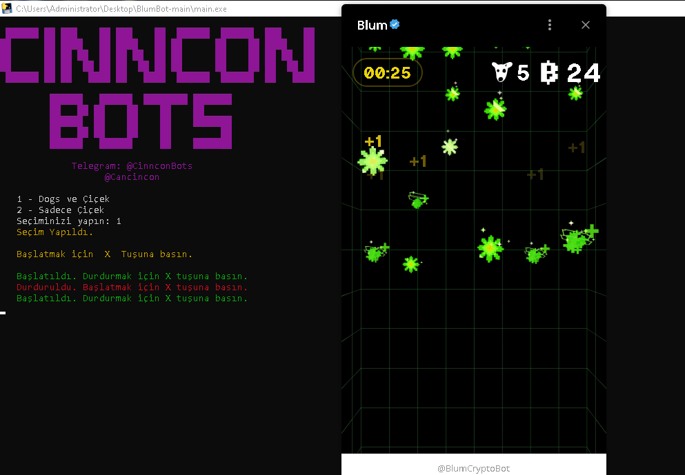

# Blum-DogsEvent-Bot

# Dosya
https://t.me/CinnconBots/246

Türkçe

1. Python 3.10'u yükleyin.
2. Install.bat dosyasını çalıştırın.
3. Bot.exe dosyasını açın.
4. Admin tarafından verilen lisans anahtarını yazın.
5. Modu seçin (Dogs etkinliği için 1, normal Blum için 2).
6. Oyunu başlatın.
7. X butonuna basarak aktif hale getirin.
8. Durdurmak için X butonunu kullanın.

Telegram Kanalımız: @CinnconBots

---

English

1. Install Python 3.10 first.
2. Run the Install.bat file.
3. Open the Bot.exe file.
4. Enter the license key provided by the admin.
5. Select a mode (1 for the Dogs event, 2 for the regular Blum).
6. Start the game.
7. Press the X button to activate it.
8. Use the X button to stop.

Our Telegram Channel: @CinnconBots
